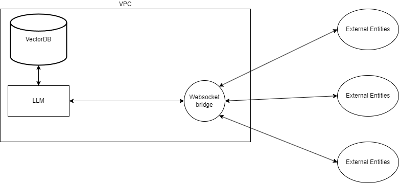

# AUSA LLM

## Overview

In this project we choose a foundational model i.e. GPT or BERT and create an API that makes it easy to interact with the LLM.

## Foundational model

We want a foundational model that can interact in the medical context. Some of the models considered here are :

- [Medical Llama-8b](https://huggingface.co/ruslanmv/Medical-Llama3-8B) - Optimized to address health related inquiries and trained on comprehensive medical chatbot dataset (Apache License 2.0) foundational model used here Meta-Llama-3-8b
- [Llama3-OpenBioLLM-8B](https://huggingface.co/aaditya/Llama3-OpenBioLLM-8B) - fine tuned on corpus of high quality of biomedical data, 8 billion parameters. Incorporated the DPO data set

## Approaches

To create a chat bot we have 2 approaches:

- Fine tuning existing foundational models on medical data set
- Create a Retrieval augmented generation framework which is used for retrieving facts from an external knowledge

### Fine tuning existing foundation models on medical data set 

- Incorporates the additional knowledge into the model itself
- Offers a precise, succinct output that is attuned to brevity.
- High initial cost
- Minimum input size 

### Retrieval Augmented Generation

- Augments the prompt with external data
- Provides an additional context during question answering.
- Possible collision among similar snippets during the retrieval process
- RAG has larger input size due to inclusion of context information ,output information tends to be more verbose and harder to steer.

### Experiment Conclusion

GPT learned 47% of new knowledge with fine-tuning with RAG this number goes upto 72% and 74%.

## Preferred approach
### What we want?
- Fast Deployment option

### Choice of Approach

RAG allows to create embeddings easily and allows for a fast deployment option.

## Architecture

## References

- https://arxiv.org/pdf/2401.08406